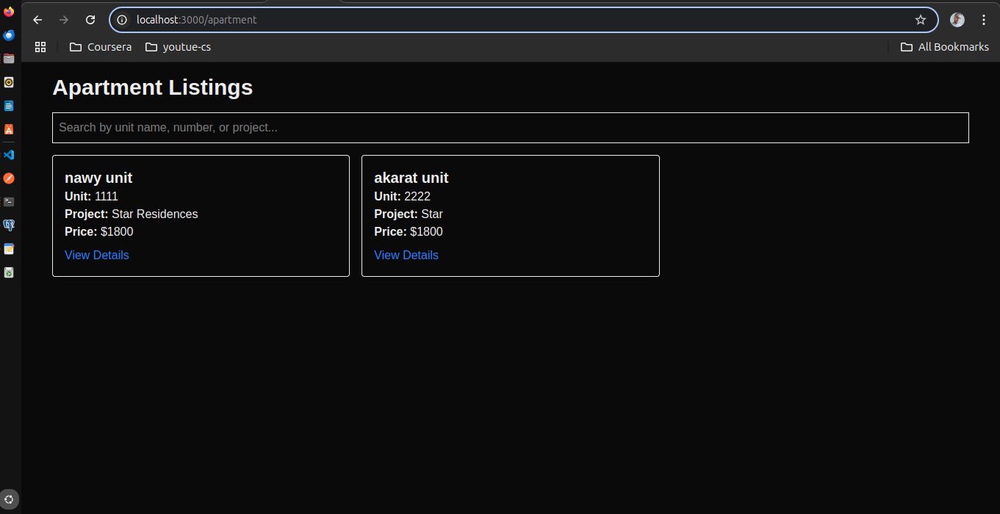
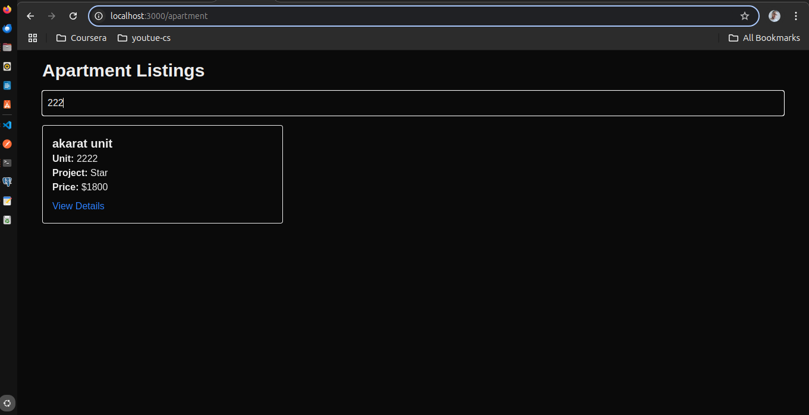
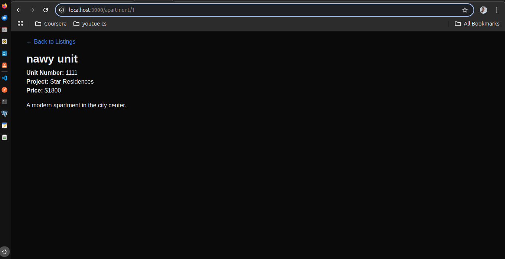

# Apartment Listing Application

A **full-stack Apartment Listing Application** built using:

- **Backend**: Node.js, Express, TypeScript, Sequelize (PostgreSQL)
- **Frontend**: Next.js, TypeScript, Tailwind CSS
- **Database**: PostgreSQL
- **Docker**: Docker Compose setup for both frontend and backend

---
# Important Notes
 - I have added the backend and frontend in one repo and one branch here for simplicity only but in the real applications we do not do that.

 - authentication was not required in the task so i made the endpoints public.


## Table of Contents

- [Overview](#overview)
- [Technologies Used](#technologies-used)
- [Project Structure](#project-structure)
  - [Backend](#backend)
  - [Frontend](#frontend)
- [Installation and Setup](#installation-and-setup)
- [Configuration](#configuration)
  - [Backend Configuration](#backend-configuration)
  - [Frontend Configuration](#frontend-configuration)
- [Database](#database)
- [Running the Application](#running-the-application)
  - [Docker Setup](#docker-setup)
  - [Manual Setup](#manual-setup)
- [API Endpoints](#api-endpoints)
- [Frontend Routes](#frontend-routes)
- [Postman Collection](#postman-collection)
- [License](#license)

---

## Overview

This is a full-stack web application that allows you to **create**, **view**, and **manage apartment listings**. The backend is written in TypeScript using Express and Sequelize ORM with a PostgreSQL database. The frontend is built with Next.js using TypeScript and Tailwind CSS.

The project is containerized with Docker, making it easy to set up and run consistently across environments.

---

## Technologies Used

### Backend
- **Node.js** – JavaScript runtime for handling server requests  
- **Express** – Web framework for creating RESTful APIs  
- **Sequelize** – ORM for database interaction  
- **PostgreSQL** – Relational database for storing data  
- **TypeScript** – Strongly typed language for improved code quality  
- **Docker** – Containerization for consistent setup across systems  

### Frontend
- **Next.js** – React framework for server-side rendering  
- **React** – Component-based frontend framework  
- **Tailwind CSS** – Utility-first CSS framework for styling  
- **TypeScript** – Static type checking for better code safety  

---

## Project Structure

### Backend
```plaintext
backend/
├── src/
│   ├── controllers/
│   │   └── apartmentController.ts      # Endpoint logic for apartments
│   ├── db/
│   │   └── index.ts                    # Sequelize database connection
│   ├── models/
│   │   └── Apartment.ts                # Apartment model
│   ├── routes/
│   │   └── apartmentRoutes.ts          # API routes for apartments
│   ├── services/
│   │   └── apartmentService.ts         # Business logic
│   └── app.ts                          # Main entry point
├── .env                                # Environment variables
├── Dockerfile                          # Docker setup for backend
├── tsconfig.json                       # TypeScript config
├── package.json                        # Backend dependencies
└── sequelize-config.json               # Sequelize config
```

---

### Frontend
```plaintext
frontend/
├── public/                             # Static assets
├── src/
│   ├── app/
│   │   ├── apartment/
│   │   │   ├── [id]/
│   │   │   │   └── page.tsx            # Apartment details page
│   │   │   └── page.tsx                # Apartment listing page
│   │   ├── favicon.ico
│   │   ├── globals.css
│   │   ├── layout.tsx                  # Main layout
│   │   └── page.tsx                    # Home page
├── Dockerfile                          # Docker setup for frontend
├── next.config.js                      # Next.js config
├── tsconfig.json                       # TypeScript config
├── package.json                        # Frontend dependencies
└── .env                                # Environment variables
```

---

## Installation and Setup


## Configuration

### Backend Configuration
Create a `.env` file in the `backend/` folder:
```bash
PORT=5000
```

### Global Configuration
Create a `.env` file in the `root` folder outside backend and frontend:
```bash
DB_HOST=db
DB_PORT=5432
DB_USER=postgres
DB_PASSWORD=postgres
DB_NAME=apartments
```

### Frontend Configuration
Create a `.env` file in the `frontend/` folder:
```bash
```

---

## Database

To create the database and tables:
1. Start the containers:
```bash
docker compose up -d
```

2. Run the migrations:
```bash
docker compose exec backend npx sequelize-cli db:migrate
```

---

## Running the Application

### Docker Setup
To build and run the containers:
```bash
docker compose up --build
```


---

## API Endpoints

| Method | Endpoint | Description |
|--------|----------|-------------|
| **GET** | `/api/apartments` | Fetch all apartments |
| **GET** | `/api/apartments/:id` | Fetch an apartment by ID |
| **POST** | `/api/apartments` | Create an apartment |

### Example JSON for Creating an Apartment:
```json
{
  "unitName": "Sunrise",
  "unitNumber": "101",
  "project": "Sunset Villas",
  "description": "A lovely apartment with plenty of sunlight.",
  "price": 1500
}
```

---

## Frontend Routes

| Route | Description |
|-------|-------------|
| `/apartment` | Home Page (Lists apartments) |
| `/apartment/:id` | Apartment details |

---

## Postman Collection

Import this Postman collection:

[Download Postman Collection](./postman_collection.json)

---

## App Screenshots







